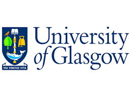

# Advanced Programming
Assessed exericise for the Advanced Programming 2018 class (MSc Software Development, University of Glasgow). 
Exercise involved creating a traffic simulator using locks and threads.

[Video demonstration](https://youtu.be/LjWsl6pnY90)

https://www.gla.ac.uk/coursecatalogue/course/?code=COMPSCI5002

